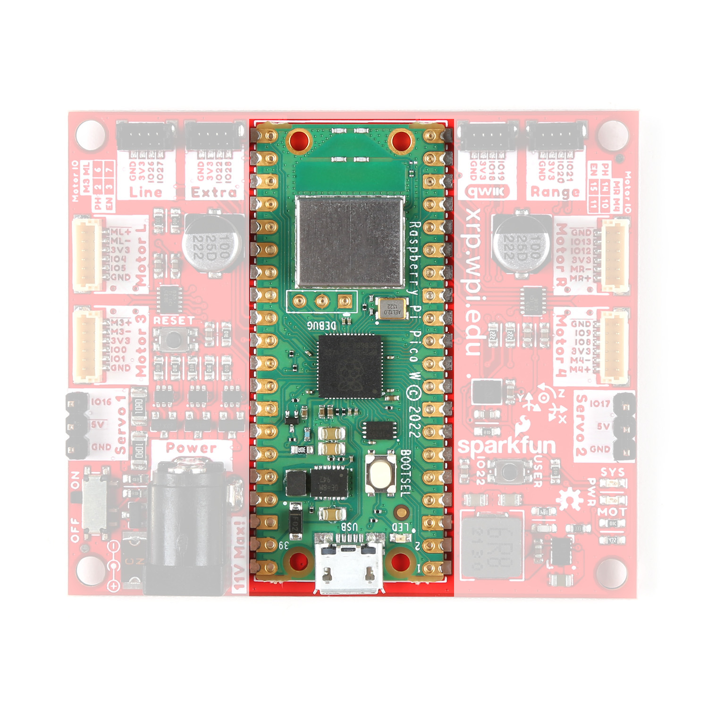
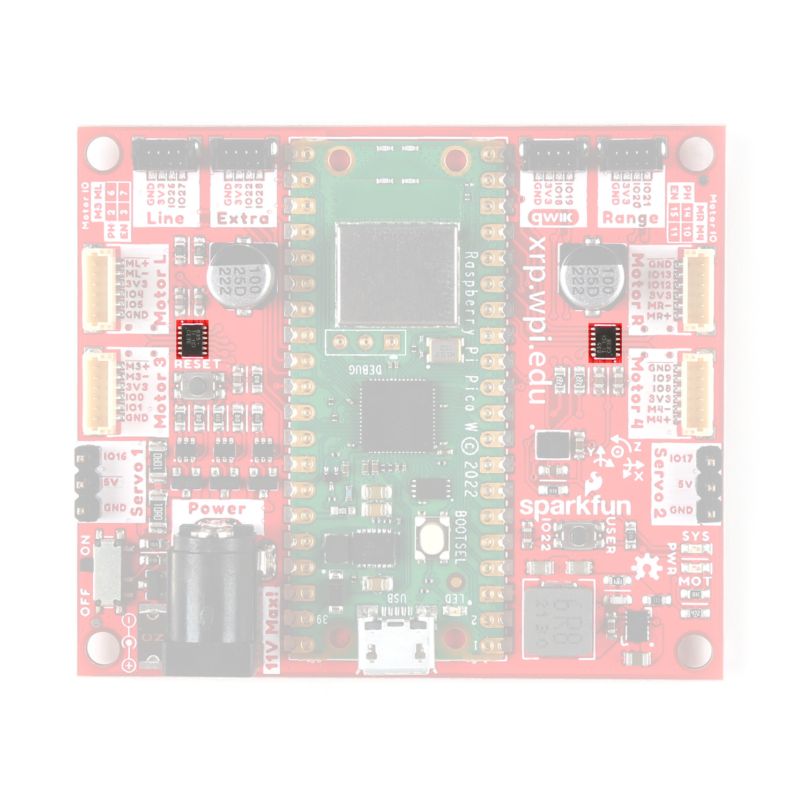
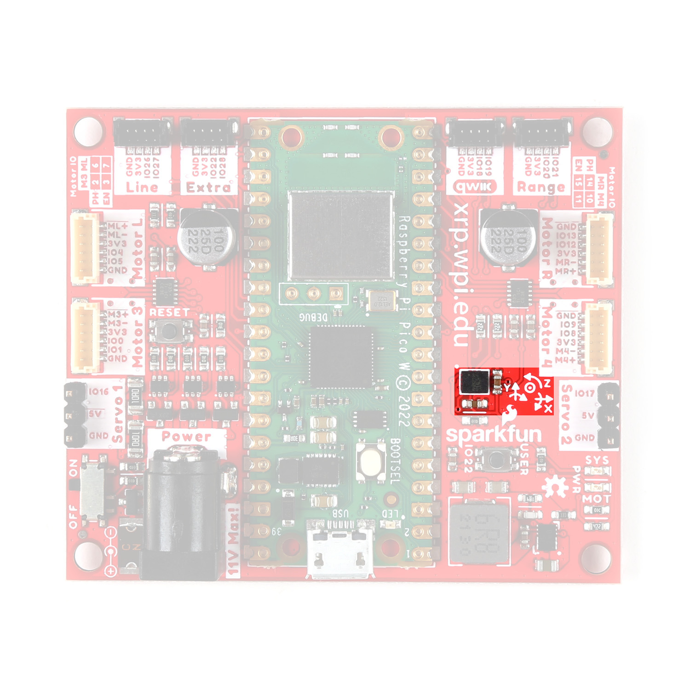
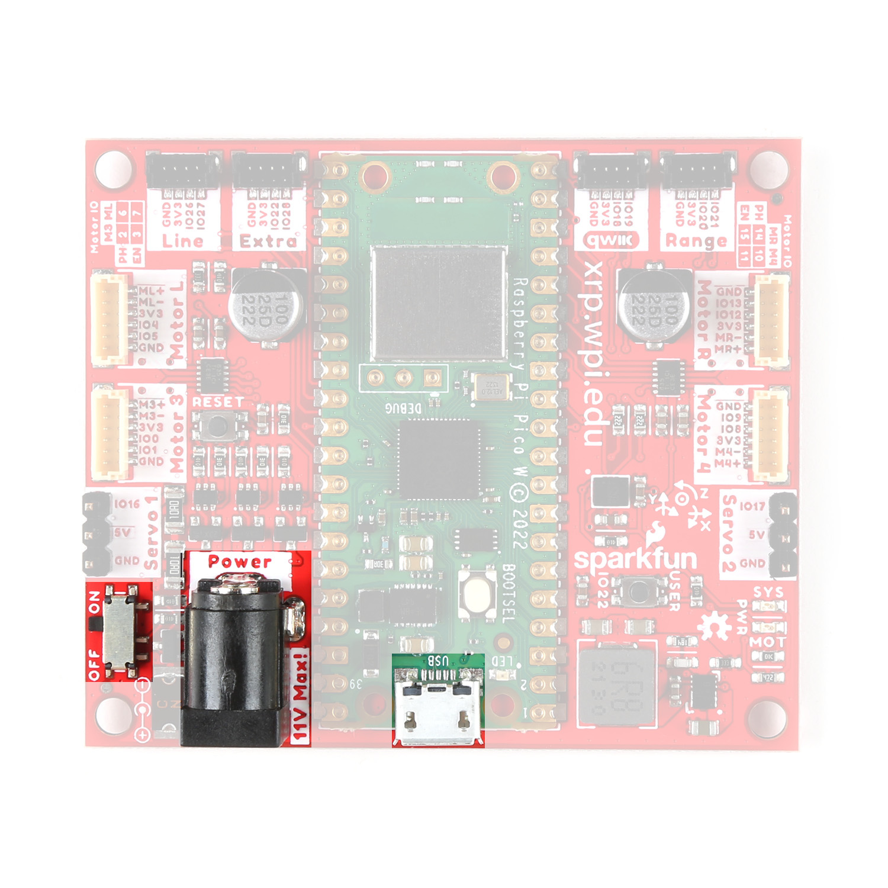
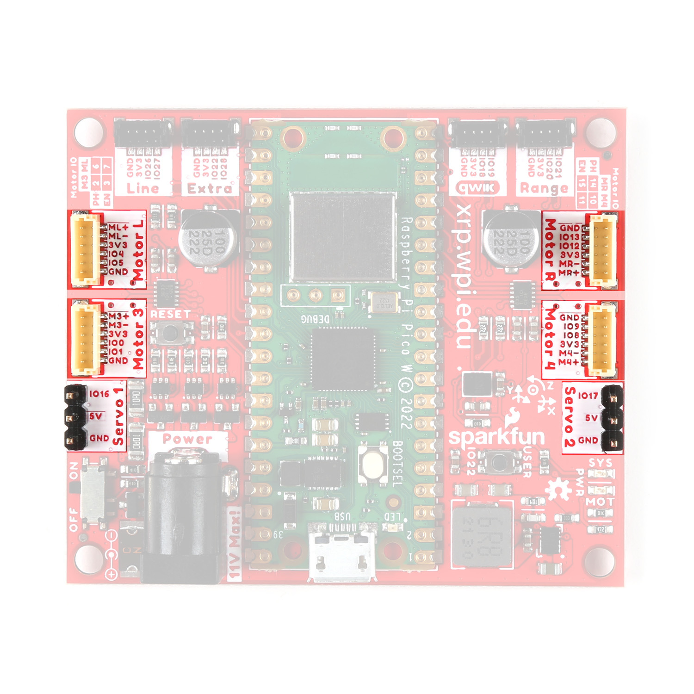
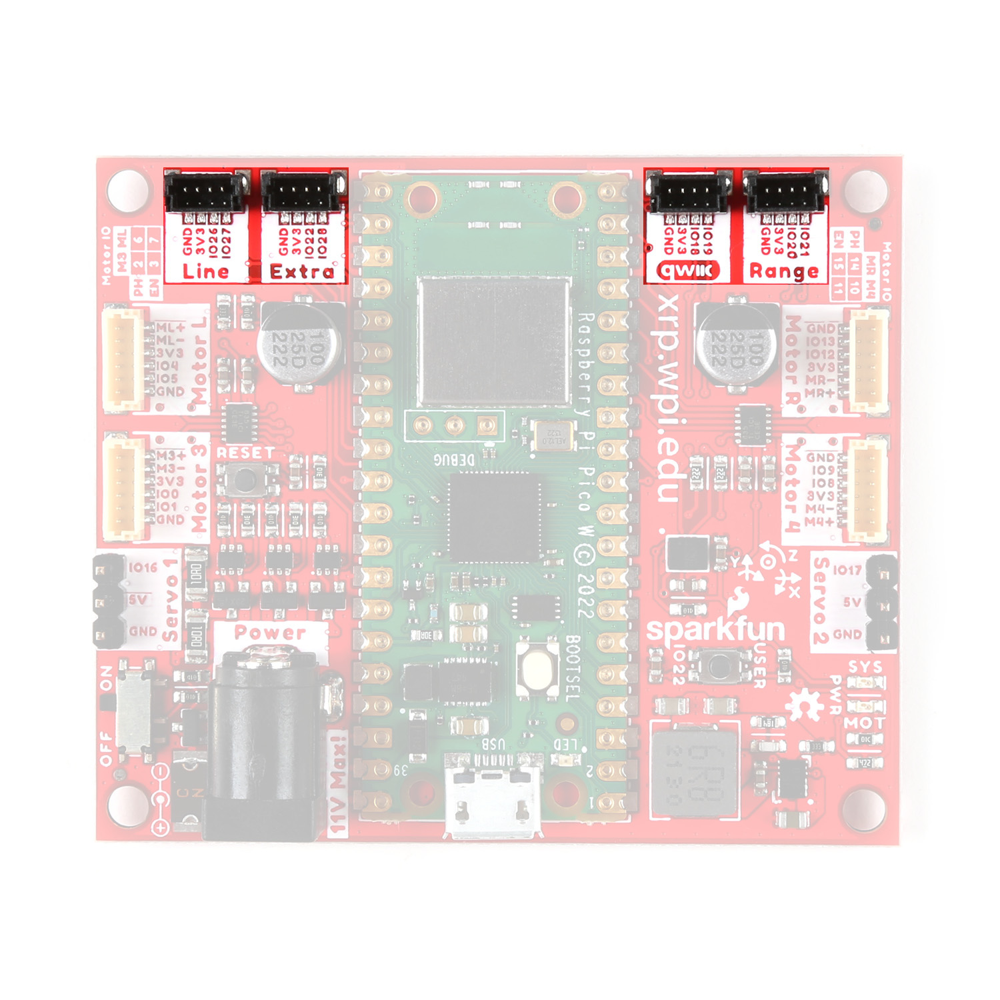
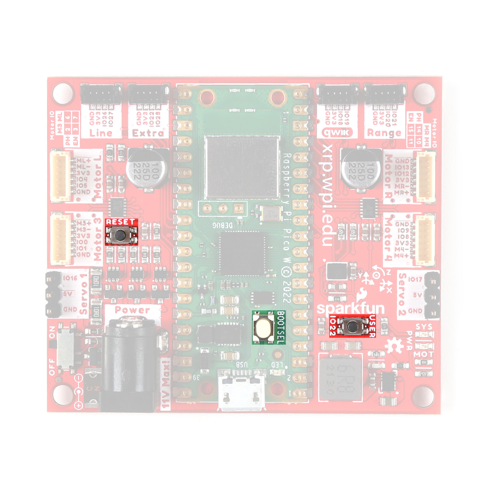
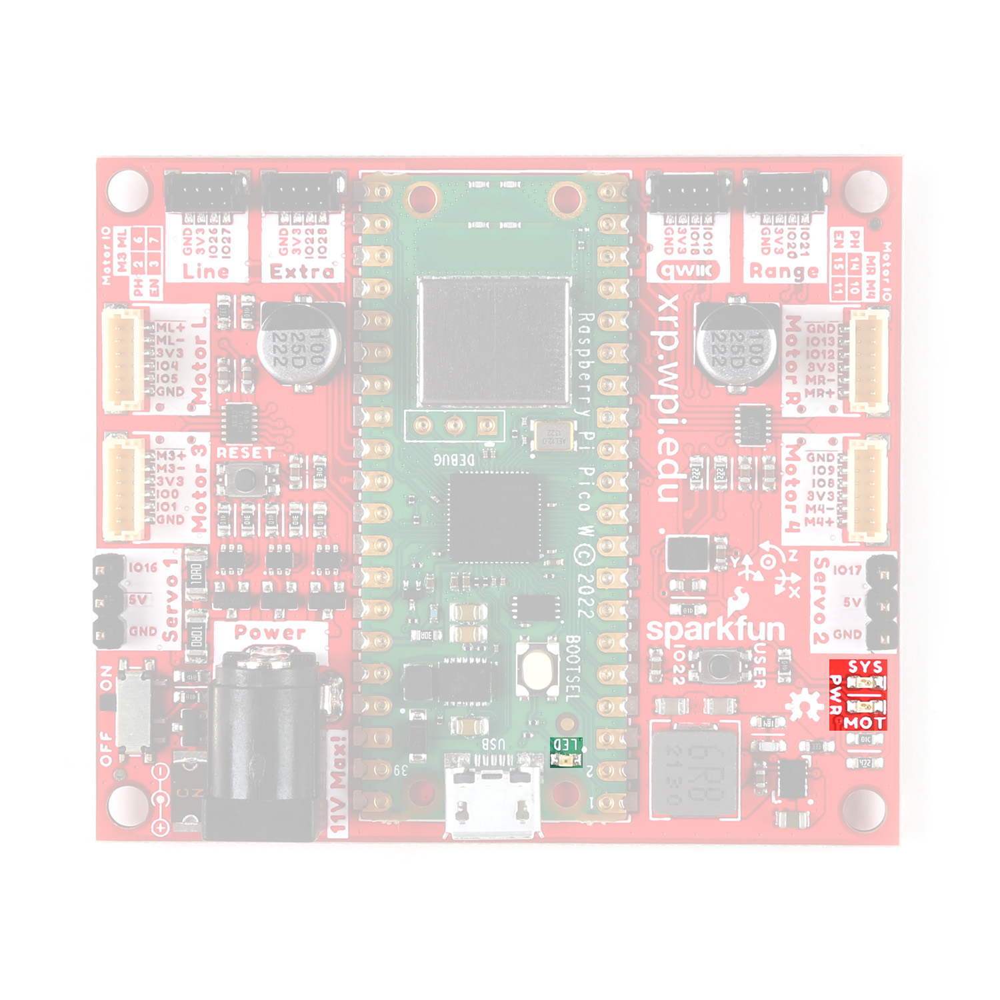
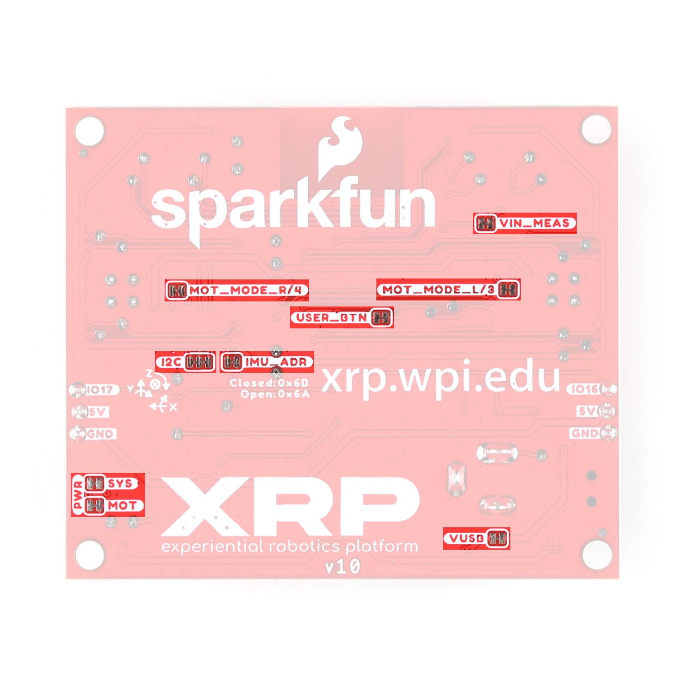

In this document, we'll take a close look at the heart of the XRP Robotics Platform Kit, the XRP Controller. This document outlines all of the parts on this board you'll interact with while building and using the XRP Robotics Platform Kit.

## Controller Board Overview

Let's take a broad look at the major components on the XRP Controller. The photo below points them out along with their names:

<figure markdown>
[{ width="400"}](./assets/img/XRP_Controller-Overview.jpg "Click to enlarge")
</figure>

You'll notice that along with the arrows showing the name of some of the smaller components, the board has what's referred to as silkscreen to label all the connectors, buttons, LEDs and other parts you'll interact with while building and using the XRP Robotics Kit.

## Raspberry Pico W

The Raspberry Pico W microcontroller acts as the brain of this board. It combines a RP2040 processor with a wireless module for both 2.4GHz 802.11n wireless LAN and Bluetooth&trade; 5.2. The RP2040 communicates with the motor controllers, IMU and other components to control the robotics kit's behavior. The photo below highlights the Pico W on the Controller Board:

<figure markdown>
[{ width="400"}](./assets/img/XRP_Controller-PicoW.jpg "Click to enlarge")
</figure>

Think of the Pico W as a brain sending signals to other parts of the "body" to tell them what to do. It has several General Purpose Input/Output (GPIO) pins that connect to the other major parts on this board so it can send and receive data from them and return it to you visually (such as seeing the motors move) or virtually (such as watching data on a computer monitor). 

## DRV8835 Motor Drivers

The pair of DRV8835 H-Bridge motor drivers on the XRP Controller Board control the direction and speed of the Robotics Kit's motors.

<figure markdown>
[{ width="400"}](./assets/img/XRP_Controller-Motor_Drivers.jpg "Click to enlarge")
</figure>

The term H-bridge comes from how this circuit design looks on a schematic diagram. It has four internal switches that control whether the motor spins Clockwise (CW), Counter Clockwise (CCW), Short Break (to slow the motor) or Stop (completely stop the motor). When going through the XRP Robotics Kit curriculum you'll learn how to program the robot to tell the motor drivers to control the motors' speed and direction.  

## 6-Dof IMU

The 6-DoF (Degrees of Freedom) IMU (Inertial Measurement Unit) combines an accelerometer and gyroscope into a single IC (integrated circuit). This sensor lets you to measure the robot's acceleration in three dimensions and also measure the orientation and angle of the robot. 

<figure markdown>
[{ width="400"}](./assets/img/XRP_Controller-IMU.jpg "Click to enlarge")
</figure>

The accelerometer in this chip has four measurement ranges of &plusmn;2/&plusmn;4/&plusmn;8/&plusmn;16 g. These ranges allow you to customize the limits of The gyroscope has five selectable measurement ranges of &plusmn;125/&plusmn;250/&plusmn;500/&plusmn;1000/&plusmn;2000 DPS (degrees per second).

## Power Components

Now let's take a closer look at the parts on this board used for providing power to it.

<figure markdown>
[{width="400"}](./assets/img/XRP_Controller-Power.jpg)
</figure>

### Barrel Jack Connector

The barrel jack connector is the primary power input for the entire XRP Robotics Kit. This connector mates with the cable from the XRP Robotics Kit's battery pack for battery-powered operation. Take note that the maximum safe voltage that can be applied to this connector is <b>11V</b> though the 4-AA battery pack included with the Robotics Kit supplies a maximum of <b>6V</b> so most users will have no issues when it comes to going past the max voltage.

### Pico W USB-Connector

The Pico W has a Micro-USB connector that can be used to power the Controller Board with <b>5V</b> from a USB cable. It also is the primary interface you'll use to initially set up the Pico W with a computer and program the Pico W over a USB cable.

### Power Switch

The power switch highlighted below controls the voltage input to the Controller Board. This two-way switch turns power on and off regardless of whether either of the power inputs discussed above is connected. You can use this to turn the robot off while keeping the battery pack or USB cable plugged in.

## Motor Connectors

The Controller Board has four six-pin connectors labeled <b>Motor L</b>, <b>Motor R</b>, <b>Motor 3</b>, and <b>Motor 4</b> and two three-pin connectors labeled <b>Servo 1</b> and <b>Servo 2</b>. 

<figure markdown>
[{width="400"}](./assets/img/XRP_Controller-Motor_Connectors_All.jpg)
</figure>

### DC Motor Connectors

The DC Motor connectors are where you'll plug in the left and right motors while assembling the kit. These connectors include the power connections for the motor as well as connections for the encoders on the motors. The Left motor connector connects the encoder's pins to GPIO4 and GPIO5 and the Right motor connector connects the encoder's pins to GPIO12 and GPIO13. You'll use these pins to monitor how many rotations the motor completes and use that data to determine the speed of the motors. The Controller Board has two extra motor connectors for expansion projects using more than two motors.

### Servo Motor Connectors

The two three-pin connectors on either side of the board are extra connectors for expansion projects using servo motors. These connectors have power pins (<b>5V</b> and Ground) and a signal pin to control the motion of the servo motor. Servo motors use a communication method called pulse-width-modulation that tells the motor to move and with some motors, where to move to. If you're interested in learning more about how servo motors work, you may want to check out SparkFun's [Servos Explained](https://www.sparkfun.com/servos) page for information and tutorials on how to use them.

## Expansion Connectors

The Controller Board has four four-pin connectors labeled (from left to right when looking at the labels upright) <b>Line</b>, <b>Extra</b>, <b>Qwiic</b>, and <b>Range</b>. Their labels indicate their use as well as which GPIO pins they connect to on the Pico W. These connectors provide an easy plug-in connection for the line follower and distance sensor as well as two extra connectors for expansion projects. These connectors are polarized meaning they only work when connected properly but because they are keyed, there is only one way to plug a cable into them.

<figure markdown>
[{width="400"}](./assets/img/XRP_Controller-Qwiic.jpg)
</figure>

### Line Follower Connector

The Line connector is where you'll plug the cable for the line follower sensor into. This connects the sensor's two signal lines, Left and Right, to the Pico W's GPIO27 (Right) and GPIO26 (Left) pins. You'll use these pins to monitor whenever the sensor detects the robot has gone past the left or right threshold when performing line-following experiments.

### Range Sensor Connector

The Range connector is where you'll plug the cable for the ultrasonic range sensor into. It connects the distance sensor's Echo and Trigger lines to the Pico W's GPIO21 (Echo) and GPIO20 (Trig). You'll use these pins to receive distance data from the ultrasonic range sensor.

### Qwiic and Extra Connectors

The last two connectors here are the Qwiic and Extra connectors. These are not used in the standard kit but we've included them to provide options to expand the capabilities of the Robotics Kit. 

The Qwiic connector works with SparkFun's [Qwiic ecosystem](https://www.sparkfun.com/qwiic) of sensors that communicate over I2C. This is a two-wire communication protocol that works with a large variety of sensors and other electronics. With this, you can customize the XRP Robotics Kit to add things like environmental sensing, OLED screens, data logging, and more!

The Extra connector has pins for both power and ground as well as pins that connect to the Pico W's GPIO28 and GPIO22. Note, these pins are <i>shared</i> with other functionality on the XRP Controller Board. GPIO28 is shared with the VIN Measure pin which lets you measure the current the robot is consuming through the primary voltage input. GPIO22 is shared with the User Button.

## Buttons

The Controller Board has three push buttons labeled <b>USER</b>, <b>RESET</b>, and <b>BOOTSEL</b> (on the Pico W). The USER button connects to GPIO22 on the Pico W which allows it to be programmed for various purposes. The RESET button does just what its name suggests and resets the entire board when pressed. This can help to reboot the robot or to restart a sequence you want the Robotics Kit to perform. Holding the BOOTSEL button either when plugging in a USB cable or when pressing the RESET button sets the Pico W to behave as a mass storage device when connected to a computer. 

<figure markdown>
[{width="400"}](./assets/img/XRP_Controller-Push_Buttons.jpg)
</figure>

## LEDs

There are three LEDs on the Controller Board labeled <b>MOT</b>, <b>SYS</b>, and <b>LED</b>. 

<figure markdown>
[{width="400"}](./assets/img/XRP_Controller-LEDs.jpg)
</figure>

These LEDs provide a visual indication to the user. The LEDs labeled <b>MOT</b> and <b>SYS</b> turn on when their respective power rails are powered. The <b>MOT</b> LED turns on when the <b>5V</b> circuit is powered. This circuit provides <b>5V</b> to the servo connectors and . The <b>SYS</b> LED turns on when the <b>3.3V</b>/System circuit is powered. This circuit powers the motor connectors and the expansion headers. The LED on the Pico W labeled <b>LED</b> is a user-programmable status LED you can program for whatever behavior you prefer. For example, you can have it turn on when the distance sensor reports a certain distance.  

## Solder Jumpers

!!! warning Advanced Users Only

    These solder jumpers can change the behavior of the board in a lasting way. Using these requires extra tools not included in the Robotics Kit along with knowledge of how to use and interact with solder jumpers. We recommend that only advanced users adjust and change the solder jumpers.

Lastly, this Controller Board has nine solder jumpers. A solder jumper provides a customization option for advanced users to control the behavior of the pins and components they connect to. Typically, these control The solder jumpers on this board are labeled (from top-to-bottom when looking at the photo below): <b>VIN_MEAS</b>, <b>MOT_MODE_R/4</b>, <b>MOT_MODE_L/3</b>, <b>USER_BTN</b>, <b>I2C</b>, <b>IMU_ADR</b>, <b>SYS</b>, <b>MOT</b>, and <b>VUSB</b>. 

<figure markdown>
[{width="400"}](./assets/img/XRP_Controller-Solder_Jumpers.jpg)
</figure>

<table>
    <tr>
        <th>Label</th>
        <th>Default State</th>
        <th>Function</th>
        <th>Notes</th>
    </tr>
    <tr>
        <td>VIN_MEAS</td>
        <td>CLOSED</td>
        <td>Completes the VIN circuit.</td>
        <td>Open to disrupt the VIN circuit to measure total current draw.</td>
    </tr>
    <tr>
        <td>MOT_MODE_R/4</td>
        <td>CLOSED</td>
        <td>Pulls the Right DRV8835's MODE pin to <b>3.3V</b></td>
        <td>Open to switch the DRV8835 to operate in IN/IN mode.</td>
    </tr>
    <tr>
        <td>MOT_MODE_L/3</td>
        <td>CLOSED</td>
        <td>Pulls the Left DRV8835's MODE pin to <b>3.3V</b></td>
        <td>Open to switch the DRV8835 to operate in IN/IN mode.</td>
    </tr>
    <tr>
        <td>USER_BTN</td>
        <td>CLOSED</td>
        <td>Completes the User Button circuit to tie it to GPIO22</td>
        <td>Open to disconnect the button from GPIO22.</td>
    </tr>
    <tr>
        <td>I2C</td>
        <td>CLOSED</td>
        <td>Pulls the SDA/SCL lines to <b>3.3V</b> through two <b>2.2k&ohm;</b></td>
        <td>Open completely to disable the pull up resistors on the I2C bus.</td>
    </tr>
    <tr>
        <td>IMU_ADR</td>
        <td>CLOSED</td>
        <td>Sets the IMU's address to <b>0x6B</b></td>
        <td>Open to switch the address to <b>0x6A</b>.</td>
    </tr>
    <tr>
        <td>SYS</td>
        <td>CLOSED</td>
        <td>Completes the SYS Power LED circuit</td>
        <td>Open to disable the SYS Power LED.</td>
    </tr>
    <tr>
        <td>MOT</td>
        <td>CLOSED</td>
        <td>Completes the MOT Power LED circuit</td>
        <td>Open to disable the MOT Power LED.</td>
    </tr>
    <tr>
        <td>VUSB</td>
        <td>CLOSED</td>
        <td>Completes the V_USB circuit to provide <b>5V</b> and <b>3.3V</b> to the board from USB</td>
        <td>Open to prevent motors and servos from being powered by USB.</td>
    </tr>
</table>

## Pinout Reference Table

The table below offers a quick reference for the complete pinout on the XRP Controller Board and which pins they connect to on the Pico W. 

<table>
    <tr>
        <th>Pico W GPIO Pin</th>
        <th>Connector Label</th>
        <th>Pin Function</th>
    </tr>
    <tr>
        <td>GPIO0</td>
        <td>Motor 3</td>
        <td>Motor 3 Encoder A</td>
    </tr>
    <tr>
        <td>GPIO1</td>
        <td>Motor 3</td>
        <td>Motor 3 Encoder B</td>
    </tr>
    <tr>
        <td>GPIO2</td>
        <td>Motor 3</td>
        <td>Motor 3 Phase Pin</td>
    </tr>
    <tr>
        <td>GPIO3</td>
        <td>Motor 3</td>
        <td>Motor 3 Enable Pin</td>
    </tr>
    <tr>
        <td>GPIO4</td>
        <td>Motor L</td>
        <td>Left Motor Encoder A</td>
    </tr>
    <tr>
        <td>GPIO5</td>
        <td>Motor L</td>
        <td>Left Motor Encoder B</td>
    </tr>
    <tr>
        <td>GPIO6</td>
        <td>Motor L</td>
        <td>Left Motor Phase Pin</td>
    </tr>
    <tr>
        <td>GPIO7</td>
        <td>Motor L</td>
        <td>Left Motor Enable Pin</td>
    </tr>
    <tr>
        <td>GPIO8</td>
        <td>Motor 4</td>
        <td>Motor 4 Encoder A</td>
    </tr>
    <tr>
        <td>GPIO9</td>
        <td>Motor 4</td>
        <td>Motor 4 Encoder B</td>
    </tr>
    <tr>
        <td>GPIO10</td>
        <td>Motor 4</td>
        <td>Motor 4 Phase Pin</td>
    </tr>
    <tr>
        <td>GPIO11</td>
        <td>Motor 4</td>
        <td>Motor 4 Enable Pin</td>
    </tr>
    <tr>
        <td>GPIO12</td>
        <td>Motor R</td>
        <td>Right Motor Encoder A</td>
    </tr>
    <tr>
        <td>GPIO13</td>
        <td>Motor R</td>
        <td>Right Motor Encoder B</td>
    </tr>
    <tr>
        <td>GPIO14</td>
        <td>Motor R</td>
        <td>Right Motor Phase Pin</td>
    </tr>
    <tr>
        <td>GPIO15</td>
        <td>Motor R</td>
        <td>Right Motor Enable Pin</td>
    </tr>
    <tr>
        <td>GPIO16</td>
        <td>Servo 1</td>
        <td>Servo 1 Signal Pin</td>
    </tr>
    <tr>
        <td>GPIO17</td>
        <td>Servo 2</td>
        <td>Servo 2 Signal Pin</td>
    </tr>
    <tr>
        <td>GPIO18</td>
        <td>Qwiic</td>
        <td>Qwiic Data Signal</td>
    </tr>
    <tr>
        <td>GPIO19</td>
        <td>Qwiic</td>
        <td>Qwiic Clock Signal</td>
    </tr>
    <tr>
        <td>GPIO20</td>
        <td>Range</td>
        <td>Range Trigger Pin</td>
    </tr>
    <tr>
        <td>GPIO21</td>
        <td>Range</td>
        <td>Range Echo Pin</td>
    </tr>
    <tr>
        <td>GPIO22</td>
        <td>Extra</td>
        <td>User Button/Extra</td>
    </tr>
    <tr>
        <td>GPIO28</td>
        <td>Extra</td>
        <td>VIN_Meas/Extra</td>
    </tr>
</table>
