In this document, we'll take a close look at the heart of the Experiential Robotics Platform (XRP) Kit, the XRP Controller. This document outlines all of the parts on this board you'll interact with while building and using the XRP Kit.

## Controller Board Overview

Let's take a broad look at the major components on the XRP Controller. The photo below points them out along with their names:

<figure markdown>
[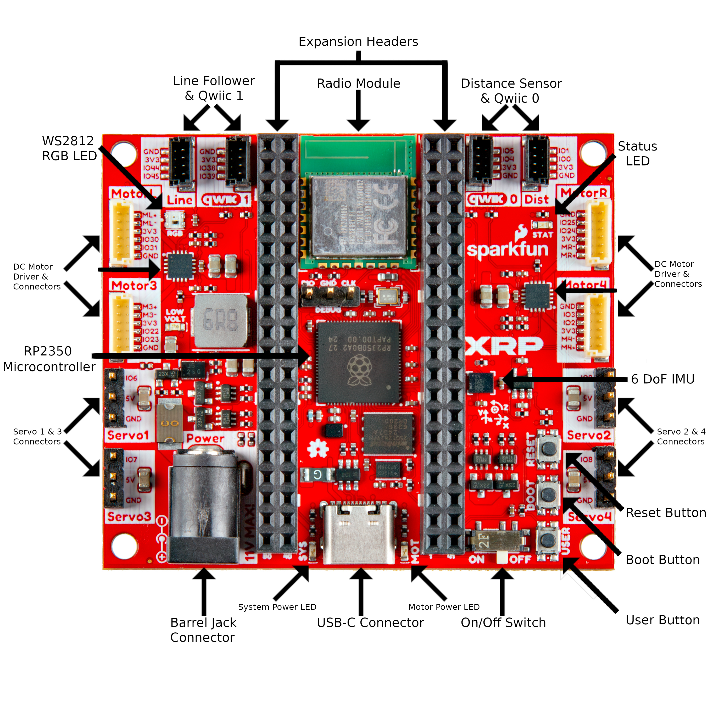{ width="600"}](./assets/img/XRP-Controller-Board-Annotated.jpg "Click to enlarge")
<figcaption>Having trouble seeing the detail in the image? Click on it for a larger view.</figcaption>
</figure>

You'll notice that along with the arrows showing the name of some of the smaller components, the board uses what's called silkscreen to label all the connectors, buttons, LEDs and other parts you'll interact with while building and using the XRP Robotics Kit.

## Raspberry Pi RP2350 & Radio Module 2

The Raspberry Pi RP2350 acts as the brain of this board. The RP2350 communicates with the motor controllers, IMU and other components to control the robotics kit's behavior. The Raspberry Pi Radio Module 2 (RM2) adds wireless connectivity to the XRP Controller over both WiFi and Bluetooth&reg;. The photo below highlights the RP2350 and RM2 on the Controller Board:

<figure markdown>
[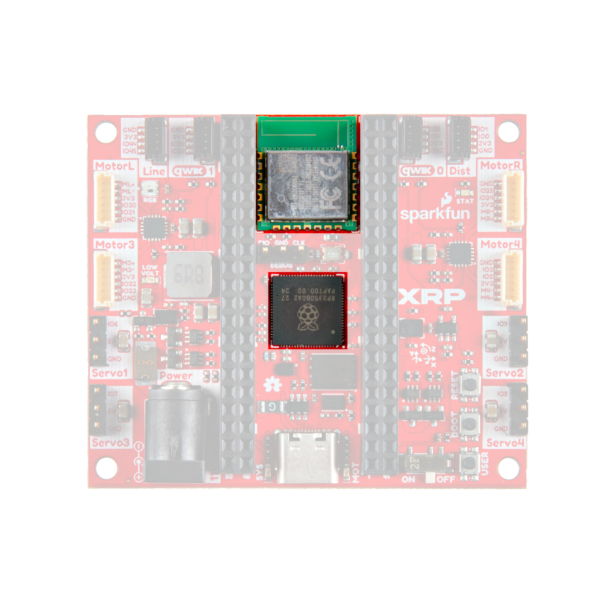{ width="600"}](./assets/img/XRP-Controller-RP2350-RM2.jpg "Click to enlarge")
</figure>

Think of the RP2350 as a brain sending signals to other parts of the "body" to tell them what to do. It has several General Purpose Input/Output (GPIO) pins that connect to the other major parts on this board so it can send and receive data from them and return it to you visually (such as seeing the motors move) or virtually (such as watching data on a computer monitor). 

The Radio Module 2 connects to both WiFi networks and Bluetooth devices allowing wireless connectivity for the XRP Kit. It communicates with the RP2350 over its serial peripheral interface (SPI) and also has a few general purpose inputs and outputs (GPIO) that are connected to the two 2x20 expansion headers on the XRP Controller Board. 

## DRV8411A Motor Drivers

The pair of DRV8411A H-Bridge motor drivers from Texas Instruments&trade; on the XRP Controller Board control the direction and speed of the XRP Kit's motors.

<figure markdown>
[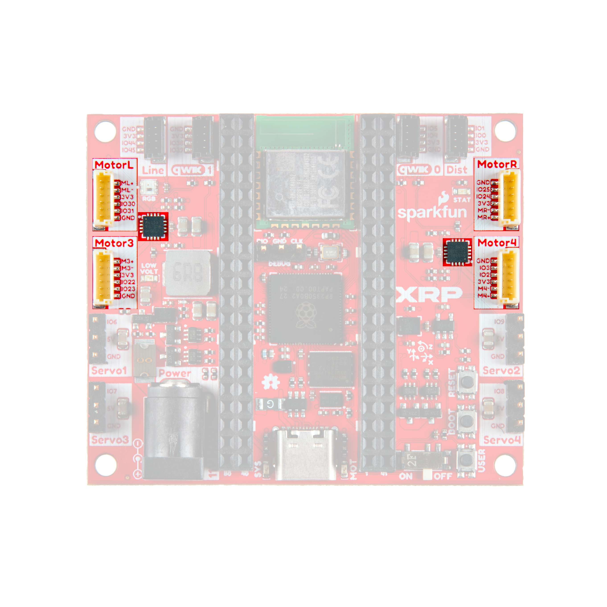{ width="600"}](./assets/img/XRP-Controller-Motors.jpg "Click to enlarge")
</figure>

The term H-bridge comes from how this circuit design looks on a schematic diagram. It has four internal switches that control whether the motor spins Clockwise (CW), Counter Clockwise (CCW), Coasts (no drive power), and Stops. When going through the XRP Kit curriculum you'll learn how to program the robot to tell the motor drivers to control the motors' speed and direction.  

## LSM6DSO 6-Dof IMU

The LSM6DSO 6-DoF (Degrees of Freedom) IMU (Inertial Measurement Unit) from STMicroelectronics&trade; combines an accelerometer and gyroscope into a single IC (integrated circuit). This sensor lets you measure the robot's acceleration in three dimensions and also measure the orientation and angle of the robot. 

<figure markdown>
[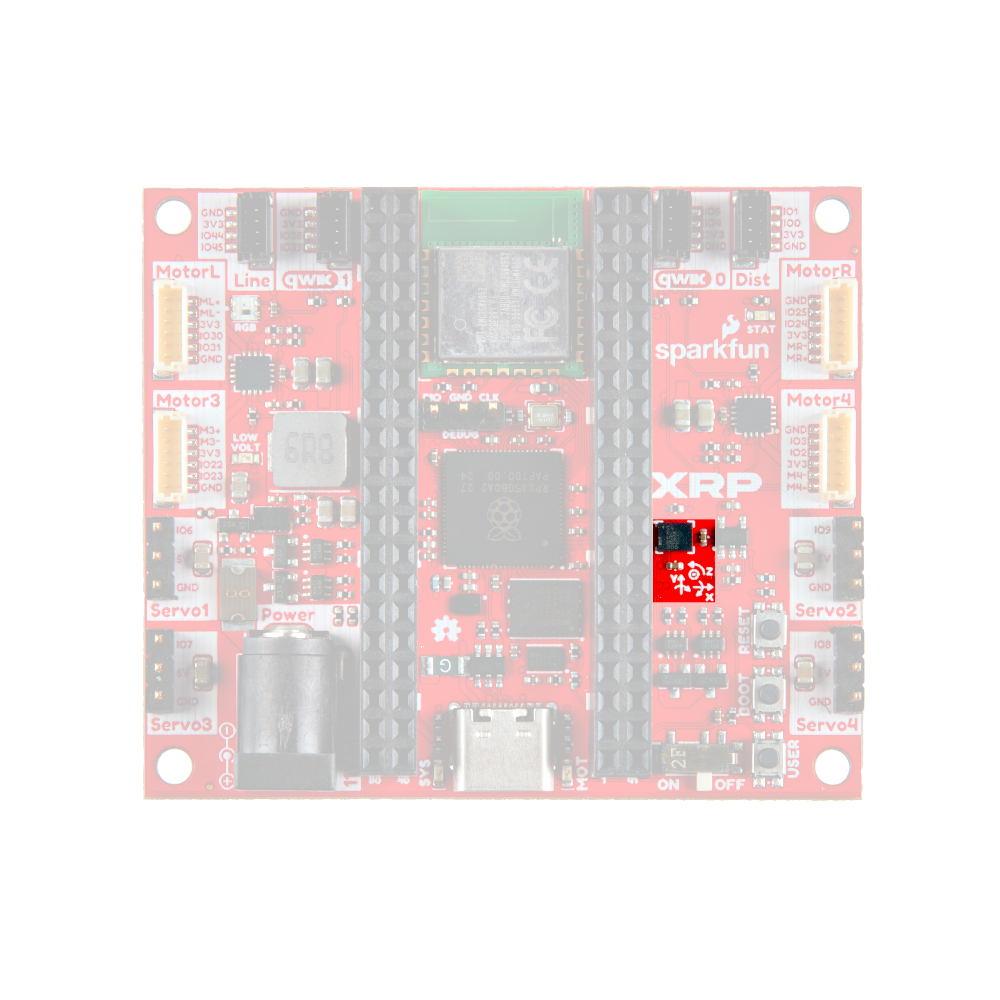{ width="600"}](./assets/img/XRP-Controller-IMU.jpg "Click to enlarge")
</figure>

The accelerometer in this chip has four measurement ranges of &plusmn;2/&plusmn;4/&plusmn;8/&plusmn;16 g. These ranges allow you to customize the limits of the acceleration forces measured. The gyroscope has five selectable measurement ranges of &plusmn;125/&plusmn;250/&plusmn;500/&plusmn;1000/&plusmn;2000 DPS (degrees per second). Refer to the silk screen symbols on the XRP Controller for the directions of each axis.

## Power Components

Now let's take a closer look at the parts on this board used for providing power to it.

<figure markdown>
[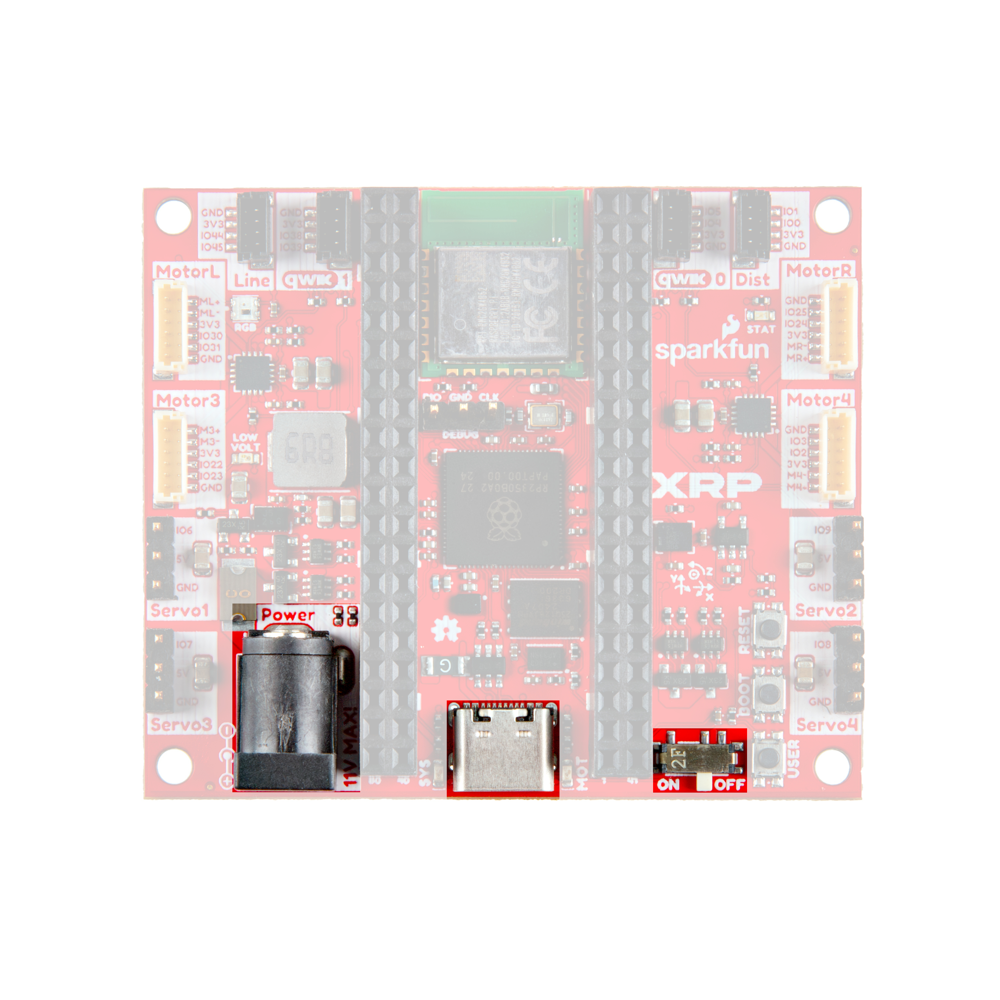{width="600"}](./assets/img/XRP-Controller-Power.jpg "Click to enlarge")
</figure>

### Barrel Jack Connector

The barrel jack connector is the primary power input for the entire XRP Kit. This connector mates with the cable from the XRP Kit's battery pack for battery-powered operation. Take note that the maximum safe voltage that can be applied to this connector is <b>11V</b> and the minimum to run the system is <b>5V</b>. The 4-AA battery pack included with the kit supplies a maximum of <b>6V</b> so most users will have no issues exceeding the max voltage.

### USB-C Connector

The USB-C connector provides power to the XRP Controller Board with <b>5V</b> from a USB cable. It also is the primary interface you'll use to initially set up the XRP Controller Board with a computer and program the RP2350 using a USB-C cable.

### Power Switch

The power switch highlighted above controls the voltage input to the Controller Board. This two-way switch turns the kit's power on and off. You can use this to turn the robot off while keeping the battery pack plugged in. The switch does not affect the RP2350's power when a USB cable is plugged in.

## Motor Connectors

The Controller Board has four six-pin connectors labeled <b>Motor L</b>, <b>Motor R</b>, <b>Motor 3</b> and <b>Motor 4</b> and four three-pin connectors labeled <b>Servo 1</b>, <b>Servo 2</b>, <b>Servo 3</b> and <b>Servo 4</b>. 

<figure markdown>
[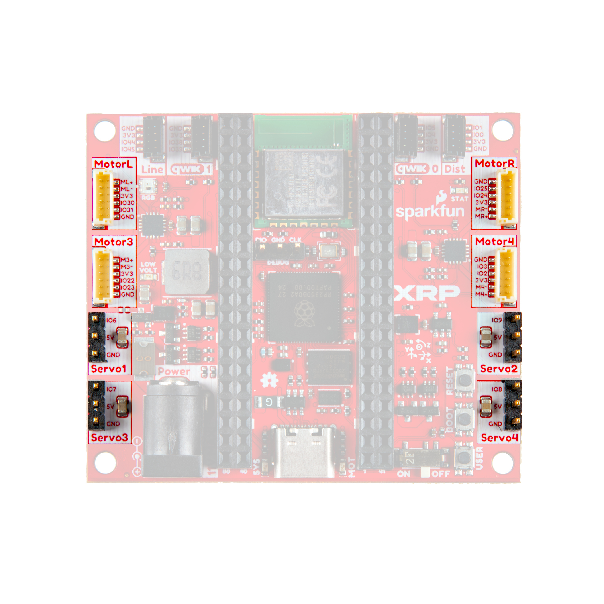{width="600"}](./assets/img/XRP-Controller-Motor-Connectors.jpg "Click to enlarge")
</figure>

### DC Motor Connectors

The DC Motor connectors are where you'll plug in the left and right motors while assembling the kit. These connectors include the power connections for the motor as well as the encoders on the motors. The board routes these connections through the motor drivers to GPIO pins on the RP2350. You'll use these pins to monitor how many rotations the motor completes and use that data to determine how far the robot has traveled. Refer to the Pinout table at the end of this document for the specific GPIO pins each motor connects to on the RP2350. The Controller Board has two extra motor connectors for expansion projects using more than two motors.

### Servo Motor Connectors

The four three-pin connectors on either side of the board labeled Servo 1, Servo 2, Servo 3 and Servo 4 mate with servo motors. You'll use the Servo 2 connector to hook up the servo included in the XRP kit. The other three connectors are extra for expansion projects. These connectors have power pins (<b>5V</b> and Ground) and a signal pin to control the motion of the servo motor. Servo motors use a communication method called pulse width modulation (PWM) that tells the motor to move and with some motors, where to move to. If you're interested in learning more about how servo motors work, you may want to check out SparkFun's [Servos Explained](https://www.sparkfun.com/servos) page for information and tutorials on how to use them.

## Sensor & Qwiic Connectors

The Controller Board has four four-pin connectors labeled (from left to right when looking at the labels upright) <b>Line</b>, <b>Qwiic 1</b>, <b>Qwiic 0</b> and <b>DIST</b>. Their labels indicate their use as well as which GPIO pins they connect to on the RP2350. These connectors provide an easy plug-in connection for the line follower and distance sensor as well as two extra connectors for expansion projects. These connectors are polarized meaning they only work when connected properly but they are keyed and there is only one way to plug a cable into them.

<figure markdown>
[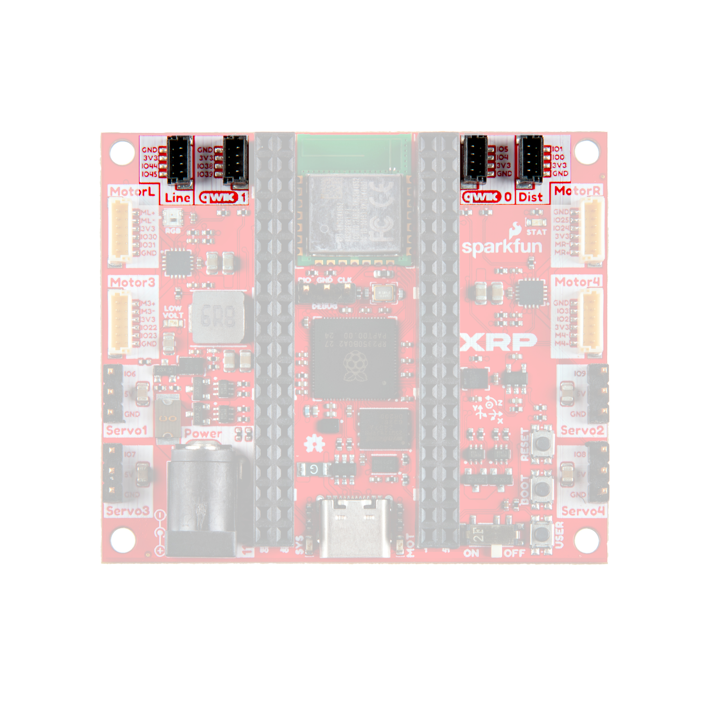{width="600"}](./assets/img/XRP-Controller-Qwiic-Connectors.jpg "Click to enlarge")
</figure>

### Line Follower Connector

The Line connector is where you'll plug the cable for the line follower sensor into. This connects the sensor's two signal lines, Left and Right, to the RP2350's GPIO44 (Left) and GPIO45 (Right) pins. You'll use these pins to monitor whenever the sensor detects the robot has gone past the left or right threshold when performing line-following experiments. When connecting the Qwiic adapter cable that plugs into this connector, make the following connections to the Line Follower Sensor:

* **Red** - **3.3V**
* **Blue** - **S1**
* **Yellow** - **S2**
* **Black** - **GND**

### Distance Sensor Connector

The Dist connector is where you'll plug the cable for the ultrasonic range sensor into. It connects the distance sensor's Echo and Trigger lines to the RP2350's GPIO0 (Trigger) and GPIO1 (Echo). You'll use these pins to receive distance data from the ultrasonic range sensor. When connecting the Qwiic adapter cable that plugs into this connector, make the following connections to the Distance Sensor:

* **Red** - **VCC**
* **Blue** - **Trig**
* **Yellow** - **Echo**
* **Black** - **GND**

### Qwiic Connectors

The Qwiic connectors work with SparkFun's [Qwiic ecosystem](https://www.sparkfun.com/qwiic) of sensors that communicate over I2C. This is a two-wire communication protocol that works with a large variety of sensors and other electronics. With this, you can customize the XRP Kit to add things like environmental sensing, OLED screens, data logging, and more!

## Buttons

The Controller Board has three push buttons labeled <b>USER</b>, <b>RESET</b> and <b>BOOT</b> (on the RP2350). 

<figure markdown>
[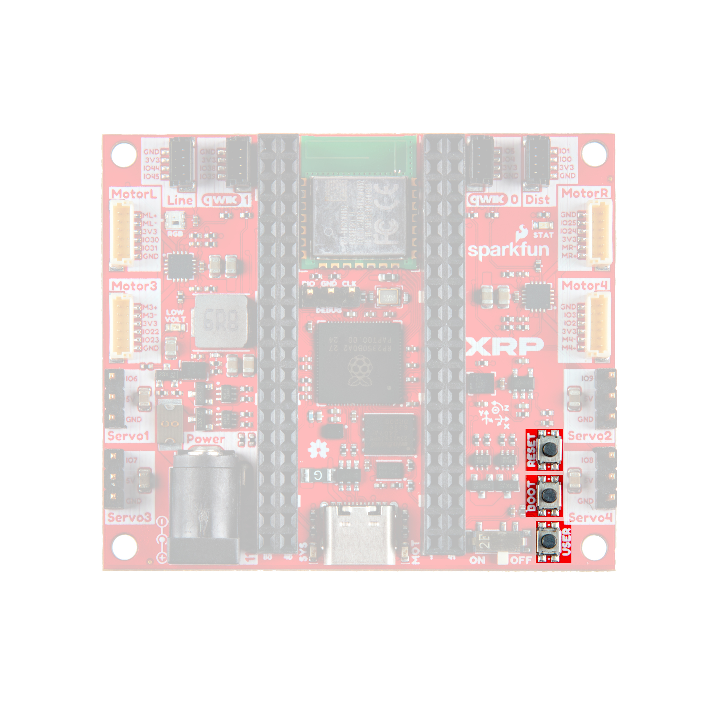{width="600"}](./assets/img/XRP-Controller-Push_Buttons.jpg "Click to enlarge")
</figure>

The USER button connects to GPIO36 on the RP2350 which allows it to be programmed for various purposes. The RESET button does just what its name suggests and resets the entire board when pressed. This can help to reboot the robot or to restart a sequence you want the Robotics Kit to perform. Holding the BOOT button either when plugging in a USB cable or when pressing the RESET button sets the RP2350 to behave as a mass storage device when connected to a computer for uploading firmware. 

## LEDs

There are five LEDs on the XRP Controller Board labeled <b>MOT</b>, <b>SYS</b>, <b>LOW VOLT</b>, <b>STAT</b> and <b>RGB</b>. 

<figure markdown>
[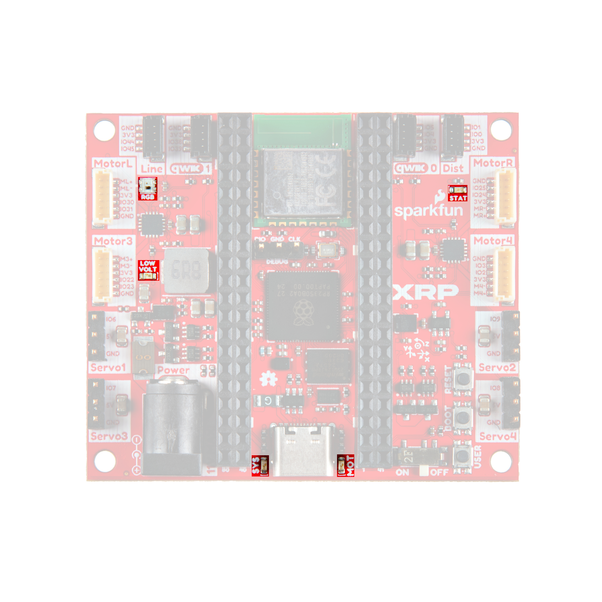{width="600"}](./assets/img/XRP-Controller-LEDs.jpg "Click to enlarge")
</figure>

These LEDs are there to provide a visual indication to users. The LEDs labeled <b>MOT</b> and <b>SYS</b> turn on when their respective power rails are powered. The <b>MOT</b> LED turns on when the motors have power available. The <b>SYS</b> LED turns on when the <b>3.3V</b>/System circuit is powered. This circuit powers the RP2350, RM2, sensors, and the expansion connectors. The <b>LOW VOLT</b> LED is a quick visual indicator to notify users that the supply voltage has dropped below the operating threshold and the board is underpowered. This is particularly helpful when powering the XRP Kit with batteries to indicate they need to be recharged or swapped. 

The other two LEDs labeled <b>STAT</b> and <b>RGB</b> are user-programmable status LEDs you can program for whatever behavior you prefer. The <b>STAT</b> LED connects to GPIO0 on the Radio Module and can be useful to indicate behavior from the radio such as connection status or data transmission. The <b>RGB</b> LED connects to GPIO37 on the RP2350 and can be programmed to change to any color based on whatever behavior you'd like. For example, you can have it turn from Green to Red when the distance sensor detects the robot is nearing an obstacle. 

## Expansion Headers

The XRP Controller Board now features a pair of 2x20 female headers that connect to nearly all the RP2350's and RM2's available pins to allow for more customization options for the XRP platform. Many of these pins are shared between the connectors and other components on the XRP Control Board so take care to ensure they are not being used by any peripherals (motors, sensors, etc.) before connecting and programming them for a different functionality.

<figure markdown>
[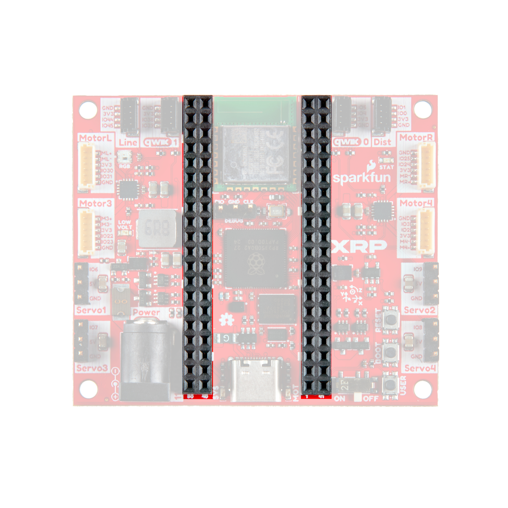{ width="600"}](./assets/img/XRP-Controller-Expansion-Headers.jpg "Click to enlarge")
</figure>

The inner rows of this expansion header nearly matches the pinout of the Pico W 2 (minus the analog-to-digital conversion pins) and can be used with peripheral boards that work with the Pico 2 W. Please note this is <b>NOT</b> a socket for a Pico 2 W. The outer row contains available GPIO pins from the RM2, extra GPIO pins from the RP2350 along with voltage pins. The image below and following table offers a quick reference for the pinout and labels on the expansion headers as well as any other connectors (motors, sensors, etc.) or peripheral (button, LED, etc.) shared between them.

<figure markdown>
[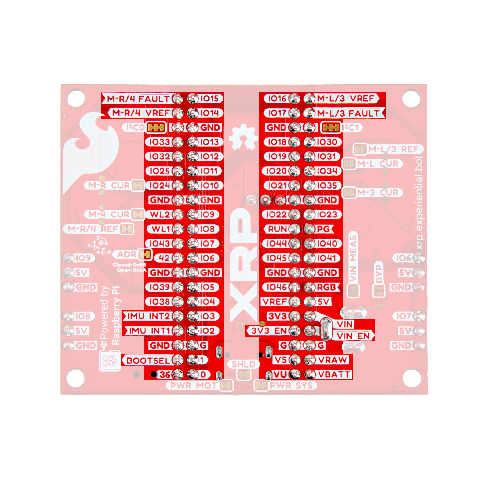{ width="600"}](./assets/img/XRP-Controller-Expansion-Pinout.jpg "Click to enlarge")
</figure> 

<figure markdown>
[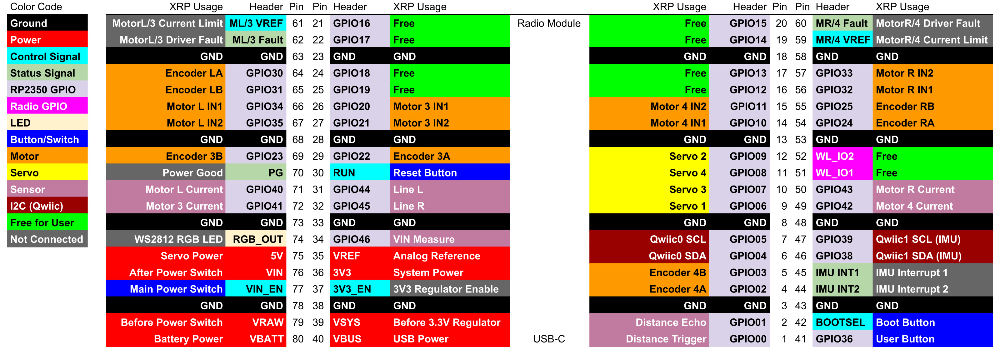](./assets/img/XRP-Controller-Expansion-Pinout-Table.jpg "Click to enlarge")
</figure>

## Solder Jumpers

!!! warning Advanced Users Only

    These solder jumpers can change the behavior of the board in a lasting way. Using these requires extra tools not included in the XRP
     Kit along with knowledge of how to use and interact with solder jumpers. We recommend that only advanced users adjust and change the solder jumpers. If you'd like to learn more about how to use solder jumpers, check out SparkFun's [How to Work with Jumper Pads and PCB Traces](https://learn.sparkfun.com/tutorials/how-to-work-with-jumper-pads-and-pcb-traces) tutorial.

The XRP Controller Board has fourteen solder jumpers. A solder jumper provides a customization option for advanced users to control the behavior of the pins and components they connect to. The solder jumpers on this board are labeled (from top-to-bottom reading left-to-right when looking at the photo below): <b>I2C0</b>, <b>I2C1</b>, <b>M-L/3 REF</b>, <b>M-L CUR</b>, <b>M-R CUR</b>, <b>M-3 CUR</b>, <b>M-4 CUR</b>, <b>M-R/4 REF</b> <b>ADR</b>, <b>VIN MEAS</b>, <b>BYPM</b>, <b>SHLD</b>, <b>PWR MOT</b> and <b>PWR SYS</b>. 

<figure markdown>
[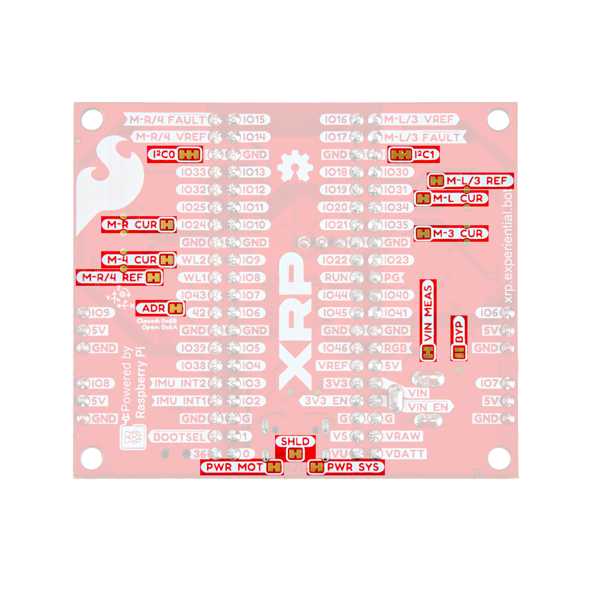{width="600"}](./assets/img/XRP-Controller-Jumpers.jpg)
</figure>

<table>
    <tr>
        <th>Label</th>
        <th>Default State</th>
        <th>Function</th>
        <th>Notes</th>
    </tr>
    <tr>
        <td>I2C0</td>
        <td>CLOSED</td>
        <td>Pulls SDA/SCL on I2C 0 to <b>3.3V</b> through two <b>2.2k&ohm;</b> resistors.</td>
        <td>Open completely to disable the pull up resistors on the I2C 0 bus.</td>
    </tr>
    <tr>
        <td>I2C1</td>
        <td>CLOSED</td>
        <td>Pulls SDA/SCL on I2C 0 to <b>3.3V</b> through two <b>2.2k&ohm;</b> resistors.</td>
        <td>Open completely to disable the pull up resistors on the I2C 1 bus.</td>
    </tr>
    <tr>
        <td>M-L/3 REF</td>
        <td>CLOSED</td>
        <td>Sets the Left/3 DRV8411 motor driver's voltage reference to <b>3.3V</b.</td>
        <td>Sets the DRV8411's reference voltage to match the system voltage. Open to set to a different voltage.</td>
    </tr>
    <tr>
        <td>M-L CUR</td>
        <td>CLOSED</td>
        <td>Connects the Left Motor current sense output to IO40.</td>
        <td>Lets users measure motor current draw using the ADC on IO40. Open to free up IO40 for other use.</td>
    </tr>
    <tr>
        <td>M-R CUR</td>
        <td>CLOSED</td>
        <td>Connects the Right Motor current sense output to IO43.</td>
        <td>Lets users measure motor current draw using the ADC on IO43. Open to free up IO43 for other use.</td>
    </tr>
    <tr>
        <td>M-3 CUR</td>
        <td>CLOSED</td>
        <td>Connects the Motor Three current senss output to IO41.</td>
        <td>Lets users measure motor current draw using the ADC on IO41. Open to free up IO41 for other use.</td>
    </tr>
    <tr>
        <td>M-4 CUR</td>
        <td>CLOSED</td>
        <td>Connects the Motor Four current sense output to IO42.</td>
        <td>Lets users measure motor current draw using the ADC on IO42. Open to free up IO42 for other use.</td>
    </tr>
    <tr>
        <td>M-R/4</td>
        <td>CLOSED</td>
        <td>Sets the Right/4 DRV8411 motor driver's voltage reference to <b>3.3V</b.</td>
        <td>This sets the DRV8411's reference voltage to match the system voltage. Open to set to a different voltage.</td>
    </tr>
    <tr>
        <td>ADR</td>
        <td>CLOSED</td>
        <td>Sets the LSM6DSO's I2C address to <b>0x6B</b>.</td>
        <td>Open to switch the I2C address to <b>0x6A</b>.</td>
    </tr>
    <tr>
        <td>VIN MEAS</td>
        <td>CLOSED</td>
        <td></td>
        <td>Open to free up IO46 for alternate use</td>
    </tr>
    <tr>
        <td>BYP</td>
        <td>OPEN</td>
        <td>Enables the fuse for the barrel jack input.</td>
        <td>Close to bypass the fuse for the barrel jack.</td>
    </tr>
    <tr>
        <td>SHLD</td>
        <td>CLOSED</td>
        <td>Connects the USB-C shield pin to the board's ground plane.</td>
        <td>Open to isolate the USB-C shield pin</td>
    </tr>
    <tr>
        <td>PWR MOT</td>
        <td>CLOSED</td>
        <td>Completes the Motor Power LED circuit.</td>
        <td>Open to disable the Motor Power LED.</td>
    </tr>
    <tr>
        <td>PWR SYS</td>
        <td>CLOSED</td>
        <td>Completes the System Power LED circuit.</td>
        <td>Open to disable the System Power LED.</td>
    </tr>
</table>

## Pinout Reference Table

The table below gives a quick reference for the complete pinout of the XRP Controller and which pins they connect to on the RP2350.

<table>
    <tr>
        <th>RP2350 GPIO Pin</th>
        <th>Connector/Peripheral Label</th>
        <th>Expansion Header Pin Label</th>
        <th>Pin Function</th>
    </tr>
    <tr>
        <td>GPIO0</td>
        <td>DIST</td>
        <td>0</td>
        <td>Distance Trigger Pin</td>
    </tr>
    <tr>
        <td>GPIO1</td>
        <td>DIST</td>
        <td>1</td>
        <td>Distance Echo Pin</td>
    </tr>
    <tr>
        <td>GPIO2</td>
        <td>Motor 4</td>
        <td>IO2</td>
        <td>Motor 4 Encoder A</td>
    </tr>
    <tr>
        <td>GPIO3</td>
        <td>Motor 4</td>
        <td>IO3</td>
        <td>Motor 4 Encoder B</td>
    </tr>
    <tr>
        <td>GPIO4</td>
        <td>Qwiic 0</td>
        <td>IO4</td>
        <td>I2C 0 Data Signal</td>
    </tr>
    <tr>
        <td>GPIO5</td>
        <td>Qwiic 0</td>
        <td>IO5</td>
        <td>I2C 0 Clock</td>
    </tr>
    <tr>
        <td>GPIO6</td>
        <td>Servo 1</td>
        <td>IO6</td>
        <td>Servo 1 Signal</td>
    </tr>
    <tr>
        <td>GPIO7</td>
        <td>Servo 3</td>
        <td>IO7</td>
        <td>Servo 3 Signal</td>
    </tr>
    <tr>
        <td>GPIO8</td>
        <td>Servo 4</td>
        <td>IO8</td>
        <td>Servo 4 Signal</td>
    </tr>
    <tr>
        <td>GPIO9</td>
        <td>Servo 2</td>
        <td>IO9</td>
        <td>Servo 2 Signal</td>
    </tr>
    <tr>
        <td>GPIO10</td>
        <td>Motor 4</td>
        <td>IO10</td>
        <td>Motor 4 Phase Pin</td>
    </tr>
    <tr>
        <td>GPIO11</td>
        <td>Motor 4</td>
        <td>IO11</td>
        <td>Motor 4 Enable Pin</td>
    </tr>
    <tr>
        <td>GPIO12</td>
        <td>None</td>
        <td>IO12</td>
        <td>Available I/O</td>
    </tr>
    <tr>
        <td>GPIO13</td>
        <td>None</td>
        <td>IO13</td>
        <td>Available I/O</td>
    </tr>
    <tr>
        <td>GPIO14</td>
        <td>None</td>
        <td>IO14</td>
        <td>Available I/O</td>
    </tr>
    <tr>
        <td>GPIO15</td>
        <td>None</td>
        <td>IO15</td>
        <td>Available I/O</td>
    </tr>
    <tr>
        <td>GPIO16</td>
        <td>None</td>
        <td>IO16</td>
        <td>Available I/O</td>
    </tr>
    <tr>
        <td>GPIO17</td>
        <td>None</td>
        <td>IO17</td>
        <td>Available I/O</td>
    </tr>
    <tr>
        <td>GPIO18</td>
        <td>None</td>
        <td>IO18</td>
        <td>Available I/O</td>
    </tr>
    <tr>
        <td>GPIO19</td>
        <td>None</td>
        <td>IO19</td>
        <td>Available I/O</td>
    </tr>
    <tr>
        <td>GPIO20</td>
        <td>Motor 3</td>
        <td>IO20</td>
        <td>Motor 3 Phase Pin</td>
    </tr>
    <tr>
        <td>GPIO21</td>
        <td>Motor 3</td>
        <td>IO21</td>
        <td>Motor 3 Enable Pin</td>
    </tr>
    <tr>
        <td>GPIO22</td>
        <td>Motor 3</td>
        <td>IO22</td>
        <td>Motor 3 Encoder A Pin</td>
    </tr>
    <tr>
        <td>GPIO23</td>
        <td>Motor 3</td>
        <td>IO23</td>
        <td>Motor 3 Encoder B Pin</td>
    </tr>
    <tr>
        <td>GPIO24</td>
        <td>Motor R</td>
        <td>IO24</td>
        <td>Motor R Encoder A Pin</td>
    </tr>
    <tr>
        <td>GPIO25</td>
        <td>Motor R</td>
        <td>IO25</td>
        <td>Motor R Encoder B Pin</td>
    </tr>
    <tr>
        <td>GPIO26</td>
        <td>None</td>
        <td>None</td>
        <td>RM2 Power On</td>
    </tr>
        <td>GPIO27</td>
        <td>None</td>
        <td>None</td>
        <td>RM2 Chip Select</td>
    </tr>
    </tr>
        <td>GPIO28</td>
        <td>None</td>
        <td>None</td>
        <td>RM2 SPI Clock</td>
    </tr>
    </tr>
        <td>GPIO29</td>
        <td>None</td>
        <td>None</td>
        <td>RM2 SPI Data</td>
    </tr>
    <tr>
        <td>GPIO30</td>
        <td>Motor L</td>
        <td>IO30</td>
        <td>Motor L Encoder A Pin</td>
    </tr>
    <tr>
        <td>GPIO31</td>
        <td>Motor L</td>
        <td>IO31</td>
        <td>Motor L Encoder B Pin</td>
    </tr>
    <tr>
        <td>GPIO32</td>
        <td>Motor R</td>
        <td>IO32</td>
        <td>Motor R Phase Pin</td>
    </tr>
    <tr>
        <td>GPIO33</td>
        <td>Motor R</td>
        <td>IO33</td>
        <td>Motor R Enable Pin</td>
    </tr>
    <tr>
        <td>GPIO34</td>
        <td>Motor L</td>
        <td>IO34</td>
        <td>Motor L Phase Pin</td>
    </tr>
    <tr>
        <td>GPIO35</td>
        <td>Motor L</td>
        <td>IO35</td>
        <td>Motor L Enable Pin</td>
    <tr>
    <tr>
        <td>GPIO36</td>
        <td>User Button</td>
        <td>36</td>
        <td>User button input</td>
    </tr>
    <tr>
        <td>GPIO37</td>
        <td>RGB</td>
        <td>RGB</td>
        <td>WS2812 Data In Pin</td>
    </tr>
    <tr>
        <td>GPIO38</td>
        <td>Qwiic 1</td>
        <td>SDA1</td>
        <td>I2C 1 Data</td>
    </tr>
    <tr>
        <td>GPIO39</td>
        <td>Qwiic 1</td>
        <td>SCL1</td>
        <td>I2C 1 Clock</td>
    </tr>
    <tr>
        <td>GPIO40</td>
        <td>None</td>
        <td>IO40</td>
        <td>Motor Left Current Measure</td>
    </tr>
    <tr>
        <td>GPIO41</td>
        <td>None</td>
        <td>IO41</td>
        <td>Motor 3 Current Measure</td>
    </tr>
    <tr>
        <td>GPIO42</td>
        <td>None</td>
        <td>IO42</td>
        <td>Motor 4 Current Measure</td>
    </tr>
    <tr>
        <td>GPIO43</td>
        <td>None</td>
        <td>IO43</td>
        <td>Motor Right Current Measure</td>
    </tr>
    <tr>
        <td>GPIO44</td>
        <td>Line</td>
        <td>IO44</td>
        <td>Line Follower Left Signal</td>
    </tr>
    <tr>
        <td>GPIO45</td>
        <td>Line</td>
        <td>IO45</td>
        <td>Line Follower Right Signal</td>
    </tr>
    <tr>
        <td>GPIO46</td>
        <td>None</td>
        <td>IO46</td>
        <td>Voltage Input Measure</td>
    </tr>
    <tr>
        <td>GPIO47</td>
        <td>None</td>
        <td>None</td>
        <td>PSRAM Chip Select</td>
    </tr>
</table>